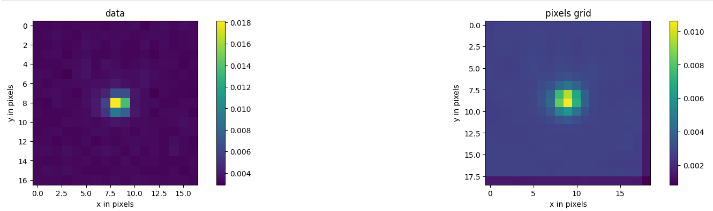
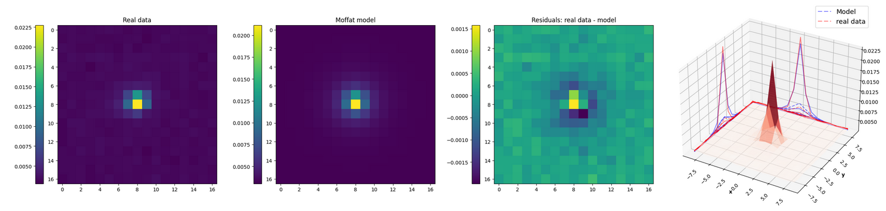

# Study and optimization of PSF processing for the ZTF experiment

## Description

As part of my M2 internship at the Centre de Calcul [CC-IN2P3](https://cc.in2p3.fr/), I optimized the PSF (Point Spread Function) code for the [ZTF](https://www.ztf.caltech.edu/) (Zwicky Transient Facility) collaboration.
Located atop Palomar Mountain in California (USA), the ZTF telescope is an astronomy observatory. 
It was inaugurated in March 2018 and is supported jointly by an international partnership of universities and institutes of Europe and Asia and the US National Science Foundation. 
Its purpose is to scan the night sky for transient and variable astronomical phenomena such as SNeIa. 
To study supernovae, ZTF team uses an image processing pipeline that consists in cleaning the data (bias, flat, non-linearity effects, etc.) and then analyzing the images, in particular with the PSF.

The official PSF code is written in C++ to run on CPUs. Although it is already optimized, we wonder if it can be further optimized. 
The PSF code consists mainly of image processing. That is why the idea of parallelization on GPUs seems a good optimization solution.
For my part, I used [Python](https://www.python.org/) with [Google JAX](https://github.com/google/jax) on CPU and GPU to compare performance on different frameworks. 
I also did some profiling thanks to [Perfetto](https://perfetto.dev/docs/) to help to understand how my code behaved. 

My work involved using two different distributions to fit the PSF model (the [Gaussian](https://en.wikipedia.org/wiki/Gaussian_function) function and the [Moffat](https://en.wikipedia.org/wiki/Moffat_distribution) function), and testing different optimizers (in my case: [minimize](https://docs.scipy.org/doc/scipy/reference/generated/scipy.optimize.minimize.html) from SciPy, [Adam](https://optax.readthedocs.io/en/latest/api/optimizers.html) from Optax and [TN-CG](https://www.cs.toronto.edu/~jmartens/docs/Deep_HessianFree.pdf) from the ztf collaboration). For more details, please read my [internship report](presentation/internship_report_Voisin_Sybille_01_06_2024.pdf).

In addition, a pixel grid has been added to better center the fit.

Here an example of the pixel grid effect:


## Installation

```bash
git clone https://github.com/SybilleVoisin/Stage_M2_ztf.git
```

**Dependencies**

You will need the following packages [ztfimg](https://github.com/MickaelRigault/ztfimg), [ztfin2p3](https://github.com/MickaelRigault/ztfin2p3) and [ztfquery](https://github.com/MickaelRigault/ztfquery) to get the data and the ztf pipeline.

I used a [Python (3.11.5)](https://www.python.org/downloads/release/python-3115/) environment overloading the ztf environment.
I worked on NVIDIA V100 GPUs, at the time of testing, the CUDA version was 12.2, which limited the version of JAX compatible.

**Requirements**

Download [requirements.json](requirements.json) file.

```json
{
  "dependencies": {
    "numpy": "1.23.5",
    "scipy": "1.11.4",
    "astropy": "5.3.4",
    "matplotlib": "3.8.2",
    "pandas": "2.1.4",
    "ipython": "8.15.0",
    "jax": "0.4.26"
    "tensorflow":"2.12.0",
    "optax":"0.2.2"
  }
}
```

You can use a Python script to read the JSON file and install the packages. Here is an example of `install_dependencies.py' script you can create:

```python
import json
import subprocess
import sys

# Charger le fichier JSON
with open('requirements.json', 'r') as f:
requirements = json.load(f)

# Installer les packages
for package, version in requirements['dependencies'].items():
  subprocess.check_call([sys.executable, '-m', 'pip', 'install', f'{package}=={version}'])
```
From the terminal, run the script:

 ```sh
 python install_dependencies.py
  ```

Useful links:
- [NumPy](https://numpy.org/)
- [SciPy](https://scipy.org/)
- [Astropy](https://www.astropy.org/)
- [matplotlib](https://matplotlib.org/)
- [pandas](https://pandas.pydata.org/)
- [IPython](https://ipython.org/)
- [JAX](https://jax.readthedocs.io/en/latest/)
- [TensorFlow](https://www.tensorflow.org/?hl=fr)
- [Optax](https://optax.readthedocs.io/en/latest/)

## Conclusions

Initial results show that using JAX on the GPU is a good solution for optimizing PSF code. Moreover the Moffat distribution fit better the PSF than the Gaussian distribution as we can as below.

PSF of a star with the Gaussian distribution:


PSF of the same star with the Moffat distribution:


The work is still in progress, so it is possible to further optimize the codes, and it is with this in mind that I have used profiling.
In fact, it is possible that the GPU is not being used optimally, and there are times when the code is waiting and nothing is happening either on the CPU or GPU side.


In this image, the first line corresponds to GPU activity, the rest to CPU activity. Ideally, we would like the GPU to be used 100% of the time, or for the CPU to take over when the GPU is not in use. 
Unfortunately, this is not the case, and there are times when nothing happens.
The next step would therefore be to understand each step performed by the GPU and CPU and try to reduce these break times as much as possible.

## Licence

[Creative Commons Attribution-NonCommercial-ShareAlike 4.0 International Public License](LICENCE.txt)

This license lets others remix, tweak, and build upon this work non-commercially, as long as they credit the authors and license their new creations under the identical terms.
